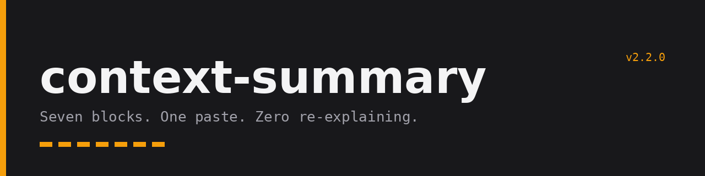
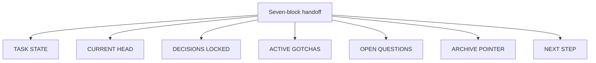
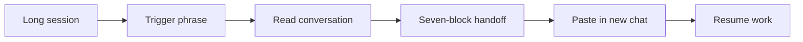

<p align="center">
  
</p>

<p align="center">
  
  
  
  
</p>

`context-summary` is a Claude.ai Personal Skill. Say "context summary" in a long conversation and it reads the chat and compresses it into a fixed seven-block markdown handoff: what the work is, where the code stands, which decisions are locked, which traps are live, what is still open, where the archive lives, and what to do next. Paste that handoff as the first message of a new conversation and you resume at full fidelity without re-explaining the project, re-deriving decisions, or rediscovering the gotcha that already cost you an hour. It is a boarding pass, not an archive.

```
+----------------------------------------------------------+
|                                                          |
|   c o n t e x t - s u m m a r y            v2.2.0        |
|                                                          |
|   Seven blocks. One paste. Zero re-explaining.           |
|                                                          |
|   [#] [#] [#] [#] [#] [#] [#]                            |
|                                                          |
+----------------------------------------------------------+
```

---

## What It Does

The skill turns the live conversation into one markdown document with a fixed shape. The shape is the point: because the seven blocks always appear in the same order with the same meaning, a fresh session knows exactly where to look for the branch state, the locked decisions, and the first action to take. Empty blocks are omitted and named in a ledger line at the top, so a missing block reads as deliberate rather than forgotten.



Any of these phrases (or a close paraphrase) invokes it:

- `context summary`
- `context handoff`
- `give me the handoff`
- `carry context forward`
- `hand this off`
- `prep the handoff`

Real invocations look like this:

```
context summary
```

```
We are out of room here, give me the handoff.
```

```
Carry context forward, I am starting a fresh chat.
```

---

## Demo

An abbreviated handoff from a multi-session Next.js API build, showing the shape of the output:

````
### TASK STATE
Building a multi-tenant SaaS API in Next.js. Story 1.1 (scaffold, base layout, route structure) done and pushed. Story 1.2 (AES-256-GCM credential encryption helpers, server-only) is next and sits on the critical path.

### CURRENT HEAD
Branch: main (primary integration branch, no feature branches in use for MVP)
Commit: 4bc7e2a security and config fixes after Story 1.1 review

### DECISIONS LOCKED
**Architecture:** Result<T> error wrapper at all external API boundaries; overrides generic try/catch (do not weaken, silent swallowed errors are the failure mode we are preventing).

### ACTIVE GOTCHAS
- AES-256-GCM requires a unique IV per encryption operation; symptom of IV reuse is silent encryption that is cryptographically broken with no runtime error; guard is generate the IV fresh inside every encrypt call, never pass it in.

### NEXT STEP
```
Continuing the B2B workflow automation API; resuming Story 1.2 (AES-256-GCM credential encryption helpers, server-only).
Begin Story 1.2 with manual review gates enabled.
The attached handoff is authoritative; read it before acting.
```
````

---

## How It Works

You say a trigger phrase. Claude reads the conversation directly, with no copy-paste from you, and emits the seven blocks as markdown with no preamble and no commentary. If a git repo is in context, it pulls live branch and commit state instead of guessing. For non-code sessions, CURRENT HEAD adapts to describe the primary artifact and its state instead of git fields.



The handoff targets roughly 3,000 tokens and treats 5,000 as a hard ceiling; past that, archive material has leaked into the boarding pass and should be cut.

---

## Installation

Claude.ai Personal Skills are installed through the Claude.ai settings interface. You need a Claude.ai account (Pro, Team, or Enterprise) that supports Personal Skills.

### Step 1: Copy the Skill File

Download or copy the raw content of `SKILL.md` from this repository.

Direct link to raw file:
```
https://raw.githubusercontent.com/thebpandey/context-summary/main/SKILL.md
```

### Step 2: Open Claude.ai Settings

1. Go to [claude.ai](https://claude.ai)
2. Click your profile icon (bottom-left of the sidebar)
3. Select **Settings**

### Step 3: Navigate to Skills

1. In Settings, find the **Skills** section (also labeled "Plugins" in some interface versions)
2. Select **Personal skills**
3. Click **Add skill** or the equivalent button

### Step 4: Paste the Skill

1. Paste the full contents of `SKILL.md` into the skill editor
2. The skill name will auto-populate from the frontmatter as `context-summary`
3. Save the skill

### Step 5: Verify Installation

Start a new conversation and type:

```
context summary
```

Claude should respond with the seven-block handoff structure immediately, without asking you to explain what it should do.

### Troubleshooting

**Skill does not trigger:** Make sure the frontmatter at the top of the skill file was included when you pasted. The `name:` and `description:` fields in the frontmatter are what Claude uses to match trigger phrases.

**Claude asks me to paste the conversation:** The skill is designed to read the current conversation directly. If Claude asks you to paste, the skill may not have loaded correctly. Re-check that the full skill file content was saved.

**Output is missing blocks:** As of v2.2, empty blocks are omitted by design and listed in the `Blocks empty this session:` ledger line at the top of the handoff. A block absent from both the output and the ledger indicates an installation problem; confirm the full SKILL.md was pasted, frontmatter included. The version in this repo is v2.2.

---

## Usage

At any point during a long working session, type:

```
context summary
```

Claude generates the seven-block handoff. Copy the entire output and paste it into the new conversation as your first message.

If you have notes, a prior handoff, or state from another conversation to fold in first, say:

```
I have context to add before you generate the handoff
```

Claude will pause for you to paste. After you paste, say `continue` and it will generate the handoff incorporating what you provided.

For short sessions (under roughly 10 turns, no accumulated decisions or gotchas), the skill produces a lean handoff: a brief TASK STATE, the populated blocks only, and a ledger line naming the omitted empty blocks. That is correct behavior, not a failure. Do not expect padded output for a thin session.

---

## File Structure

```
context-summary/
  SKILL.md          the skill itself, paste this into Claude.ai
  README.md         this file
  CHANGELOG.md      version history
  CONTRIBUTING.md   how to propose changes
  LICENSE           MIT
  .gitignore
  assets/
    hero.png        banner image
```

---

## Author

**Bhaskar Pandey**

Builder, technical strategist, and real estate professional. Not affiliated with Anthropic.

- GitHub: [github.com/thebpandey](https://github.com/thebpandey)
- LinkedIn: [linkedin.com/in/pandeybhaskar](https://www.linkedin.com/in/pandeybhaskar/)
- X: [@thebpandey](https://x.com/thebpandey)
- Email: [bhaskar.knp@gmail.com](mailto:bhaskar.knp@gmail.com)

If you find issues or want to propose changes, GitHub Issues and pull requests are preferred. For everything else, reach out on LinkedIn or X.

---

<p align="center">
  Built by Bhaskar Pandey / Almora Technology<br>
  <a href="https://github.com/thebpandey">GitHub</a> &middot;
  <a href="https://www.linkedin.com/in/pandeybhaskar">LinkedIn</a> &middot;
  MIT
</p>

---

## License

MIT. Use freely, modify for your workflow, share with attribution.

